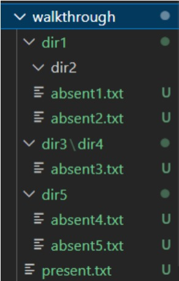
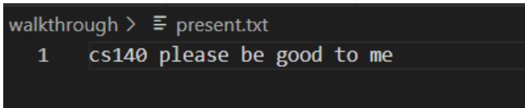
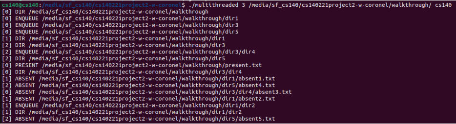

# Linux-based parallel grep runner in C

A multithreaded parallel grep runner program written in C that divides the workload of searching through all file contents in a directory
tree among parallel threads  

# Sample Run 

<b> Consider the list of directories and files in the image below </b>  

    

 

We have the following: 
<ul>
    <li> walkthrough</li>
    <li> dir1</li>
    <li> dir2 </li>
    <li> dir3 </li>
    <li> dir4 </li>
    <li> dir5 </li>
    <li> 5 absent text files with contents that do not contain the string 'cs140' </li>
    <li> 1 present text file with content that do contain the string 'cs140' </li>
</ul>  
<b> String to be searched for: cs140 </b>  

Shown in the image below is the content of present.txt  

    

  
Running the following in the command line:  
<b> ./multithreaded 3 /media/sf_cs140/cs140221project2-w-coronel/walkthrough/ cs140 </b>  
<b> Command line arguments: </b>  
<ul>
    <li> argv[0]: ./multithreaded </li>
    <li> argv[1]: 3 (number of workers/threads)</li>
    <li> argv[2]: /media/sf_cs140/cs140221project2-w-coronel/walkthrough/ (path)</li>
    <li> argv[3]: cs140 (string to be searched for)</li>
</ul>
  
We get the following output:  

    

  

**As we can see from the screenshot above, the program outputted one PRESENT, five ABSENTs, and six DIRs.**  
**Moreover, we can see the number of workers/threads that did the process of searching**

